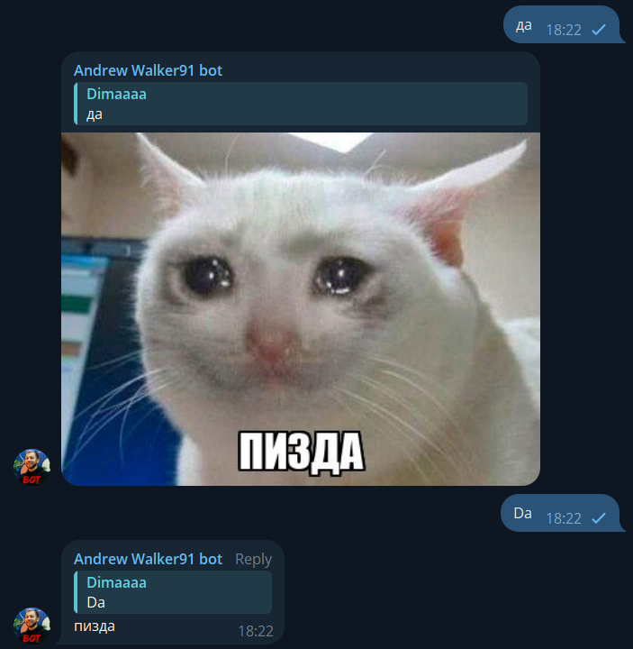
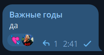

# Andrew Walker91 Bot 🤖

Telegram-бот, который отвечает "пизда", если кто-то пишет "да" или "da" — только как отдельное слово.  
Создан в честь легендарного **@andrew_walker91**, который отвечает так в каждом чате.

---

## 🔧 Возможности

- 💬 Реагирует на сообщение с **"да"** или **"da"**
- 🎲 Отвечает фразой или случайной картинкой
- 📌 Отвечает **в ответ на сообщение**
- 📊 Поддерживает статистику по чату
- 🔁 Поддержка **редактированных сообщений**
- 💘 **Ставит реакцию** на каждое _N_-ое сообщение в чате (от 100 до 500), где _N_ выбирается случайно

---

## 💘 Реакции

Бот выбирает случайное число от `100` до `500` для каждого чата. Когда общее количество сообщений достигает этого числа —  
он ставит реакцию **💘** на текущее сообщение, сбрасывает счётчик и выбирает новое число.

> 🔐 Для работы реакций бот должен быть админом в группе и находиться в супергруппе (иначе Telegram не разрешает добавлять реакции).

---

## 🖼 Пример работы

### Ответ на "да"


### Реакция 💘 на сообщение
<!-- ВСТАВЬ СЮДА КАРТИНКУ С ПРИМЕРОМ -->


---

## 🛠 Разработка

Установка зависимостей:

```bash
npm install
